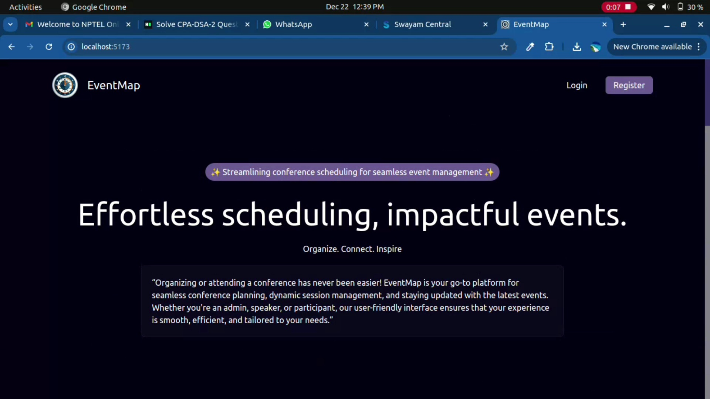
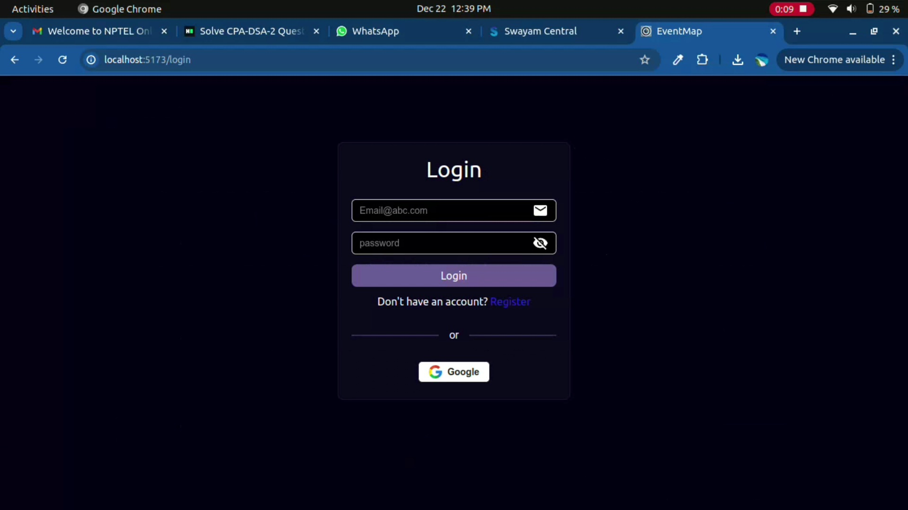
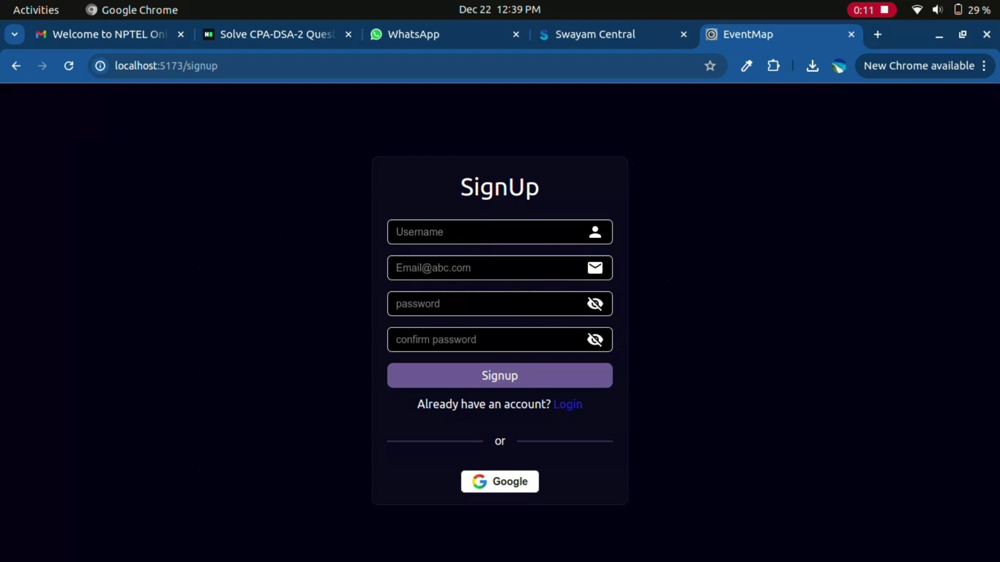
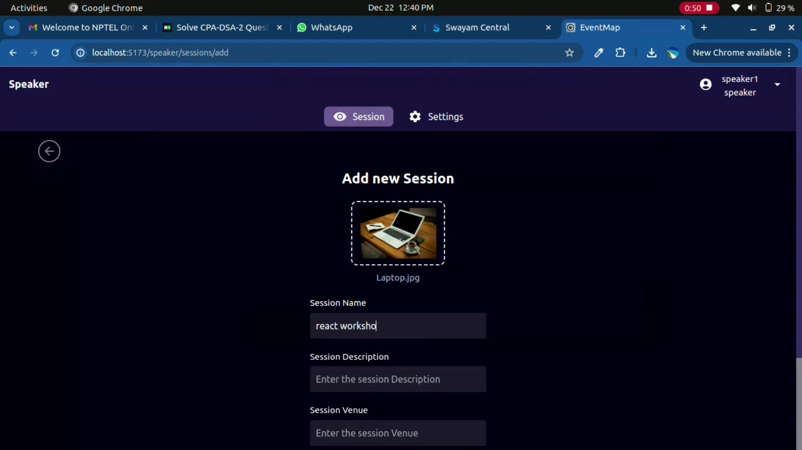
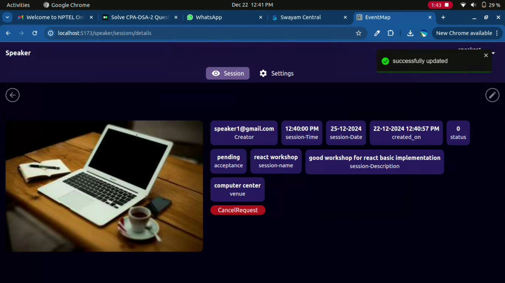
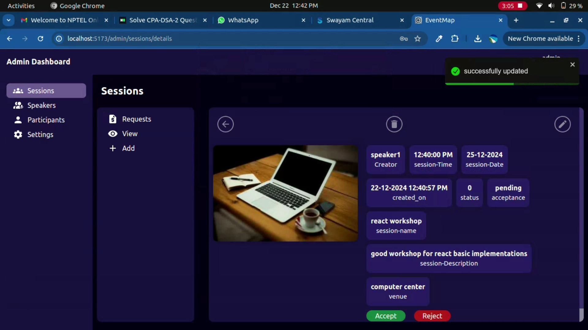
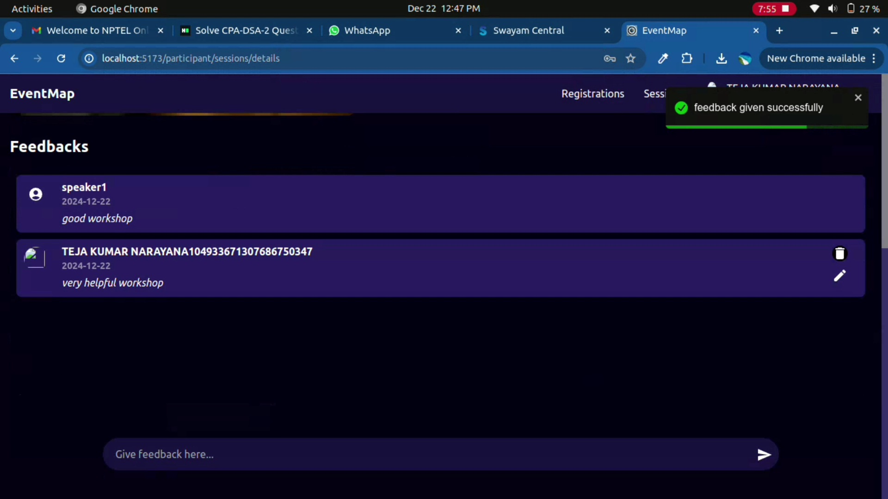
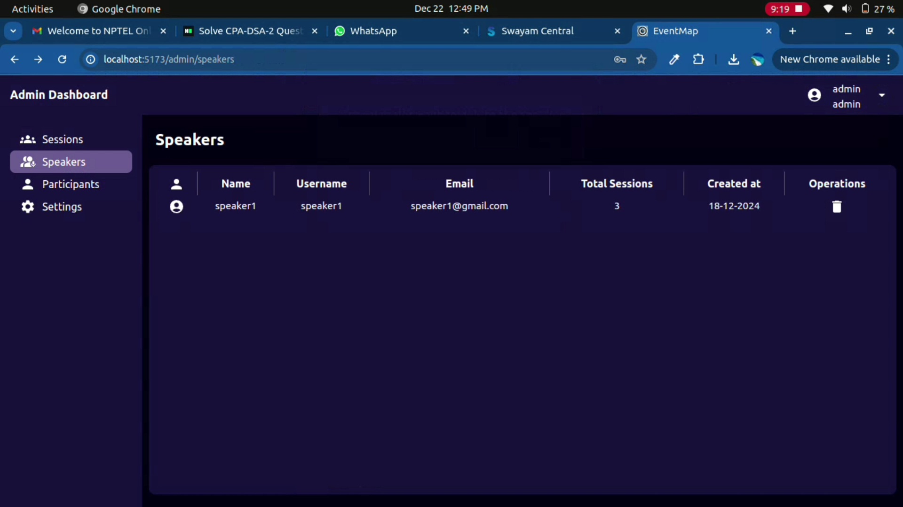

# Eventmap frontend

EventMap is crafted to enhance the conference experience by providing tools for manual scheduling and efficient role-based management.

## Technical Skills:
- Frontend: ReactJS, TailwindCSS
- Backend: ExpressJS, NodeJS
- Database: MongoDB, Redis
- Authentication: Google OAuth 2.0 alongside traditional email-based signup and login

## Key Features:
1. Admin Panel: Manage users, approve speaker-created sessions, and control the conference schedule for better oversight.
2. Speakers: Propose sessions for admin approval, manage approved sessions, and view feedback to refine future presentations.
3. Participants: Explore and enroll in admin-approved sessions and provide feedback.

## Sample UIs:
### Home Page:

### Login:

### SignUp:

### Session Add:

### Session Details:

### Admin session Requests Page:

### Feedback Page:

### Admin Page with speakers list:

